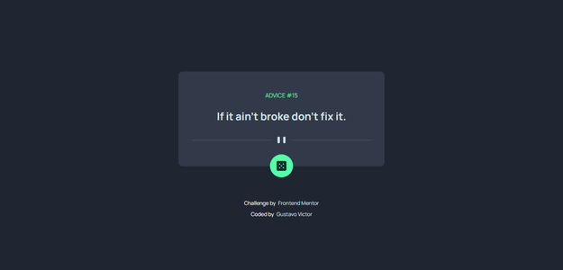
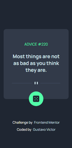

# Frontend Mentor - Advice generator app

Este projeto é uma solução do desafio [Advice generator app](https://www.frontendmentor.io/challenges/advice-generator-app-QdUG-13db) do Frontend mentor que é  uma plataforma de desafios que te ajuda a melhorar suas habilidades de codificação e desenvolviemnto através da construção de projetos reais. 

## Tabela de conteúdos

- [Visão Geral](#visão-geral)
  - [O desafio](#odesafio)
  - [Screenshots](#screenshots)
  - [Links](#links)
- [Meu processo](#meu-processo)
  - [Tecnologias](#tecnologias)
  - [Fontes](#fontes)
  - [Ferramentas](#ferramentas)
- [Como-começar](#como-começar)
  - [Pré-requisitos](#pré-requisitos)
  - [Instalação](#instalação)
- [Autor](#author)
- [Licença](#licença)

<hr/>


## 💻Visão Geral

### O desafio

O projeto é um gerador de conselhos que busca dados de [API](https://api.adviceslip.com/advice) e exibe de maneira formatada um conselho sempre que a página carrega pela primeira vez ou quando o usuário clica no botão. 

No projeto, os usuários são capazes de:

- [x] Ver layout adaptado para dispositivos com tamanhos de tela diferentes 
- [x] Ver estados de hover e clique para todos os elementos interativos na página
- [x] Gerar um novo conselho ao clicar no ícone de dados

### Screenshots

 

### Links

- [Aplicação no Netlify](https://benevolent-crumble-4b82fd.netlify.app/)


## 🛠Meu processo

### Tecnologias

- [HTML5](https://developer.mozilla.org/pt-BR/docs/Web/HTML)
- [Sass](https://sass-lang.com/)
- [React](https://reactjs.org/)
- [React Icons](https://react-icons.github.io/react-icons/)
- [TypeScript](https://www.typescriptlang.org/)
- [Vite](https://vitejs.dev/)

### Fontes

- [Manrope (400, 700, 800)](https://fonts.google.com/specimen/Manrope)

### Ferramentas

- [Visual Studio Code](https://code.visualstudio.com/)


## Como começar

Para ver a aplicação em tempo real, clique [neste link](https://benevolent-crumble-4b82fd.netlify.app/). 
Já, se você quiser fazer a instalação do projeto em sua máquina local e tiver dúvidas de como fazer isso, confira o tutorial a seguir. 

### Pré-requisitos 

Antes de começar, é importante que você tenha o [Node.js](https://nodejs.org/en) instalado na sua máquina para rodar aplicações JavaScript e o [GIT](https://git-scm.com/) para executar os comandos de terminal seguintes.
Além disso, para entender e conseguir acompanhar o projeto, é recomendado que você tenha conhecimentos básicos de HTMl, CSS, JavaScript e ReactJS.  

### Instalação

1. Faça download do projeto ou clone ele com o comando: 

```bash
  git clone https://github.com/Gustavo-Victor/advice-generator-app.git
```

2. Entre na pasta do projeto (antes descompacte se tiver baixado o zip) e abra o terminal. A seguir, comando para entrar na pasta: 

```bash
  cd advice-generator-app/ 
```

3. Instale as dependências 

```bash
  npm install yarn -g 
```

```bash 
  yarn 
```

4. Execute o projeto em ambiente de desenvolvimento
```bash
  yarn dev 
```

5. Abra o projeto no navegador digitando na barra de pesquisa: localhost:5173/ 


## 🦸‍♂️Autor

- Website - [gustavovictor](http://gustavovictor.me/)
- Frontend Mentor - [@Gustavo-Victor](https://www.frontendmentor.io/profile/Gustavo-Victor)
- CodePen - [@gustavo_victor](https://codepen.io/gustavo_victor)


<hr/>

## 📋Licença

Este projeto está sob a licença [MIT](./LICENSE.md) 

Qualquer pessoa pode usar e contribuir com este projeto ✌

